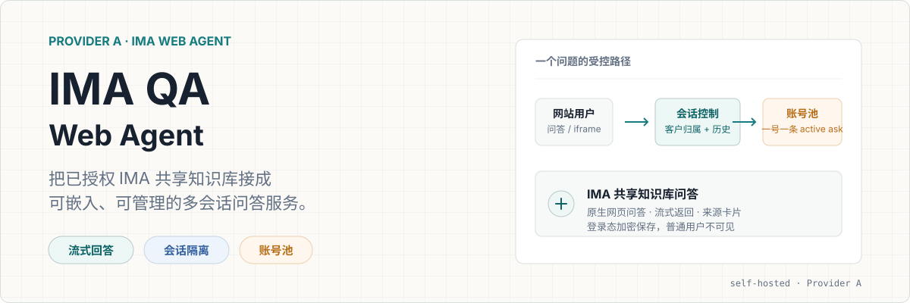
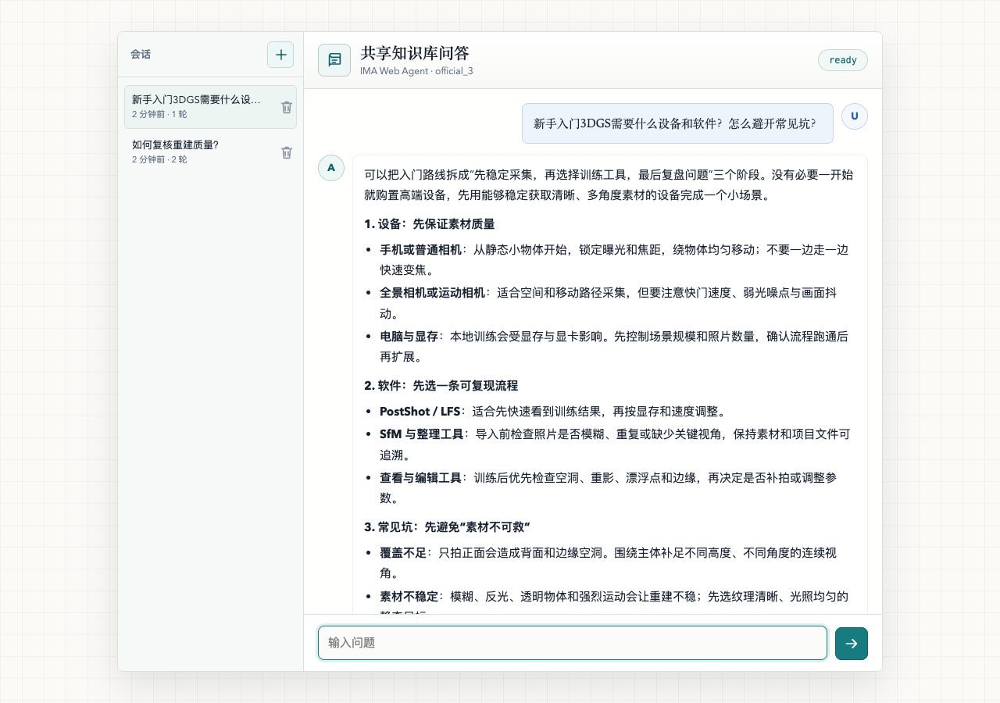
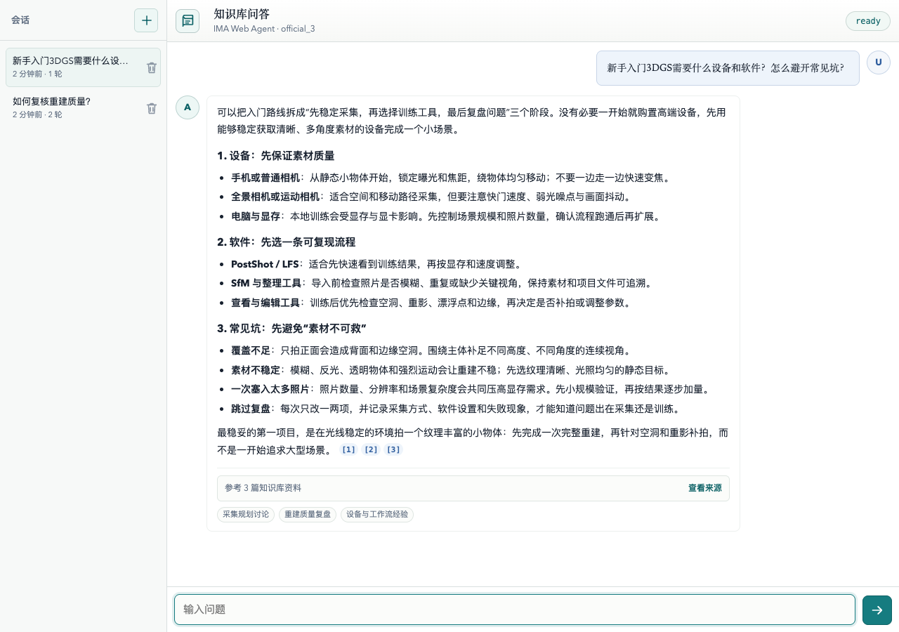
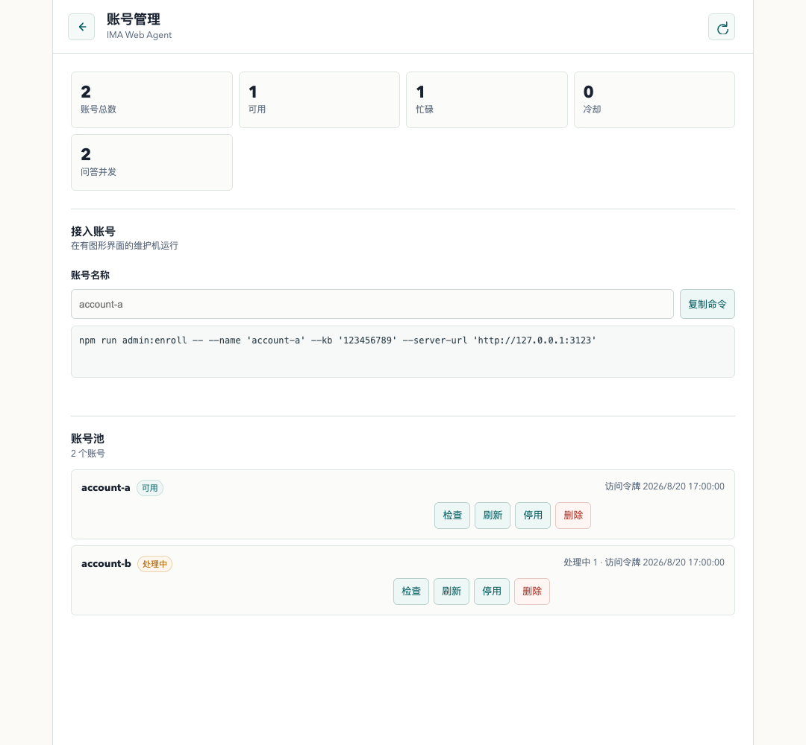
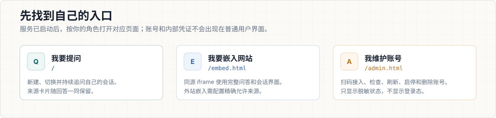
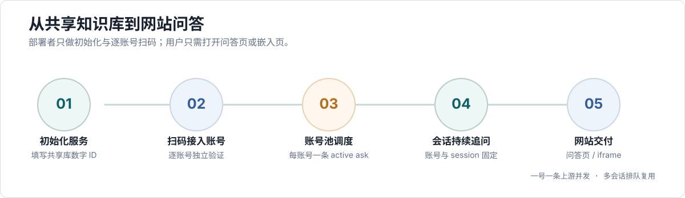

<p align="center">
  
</p>

<p align="center">
  <a href="#五分钟跑通"><strong>开始部署</strong></a>
  &nbsp;·&nbsp;
  <a href="#账号接入"><strong>接入账号</strong></a>
  &nbsp;·&nbsp;
  <a href="#会话与账号池"><strong>理解会话与并发</strong></a>
  &nbsp;·&nbsp;
  <a href="./docs/DEPLOYMENT.md"><strong>部署文档</strong></a>
</p>

> 一个面向网站交付的 IMA 共享知识库问答服务。它通过**已授权账号**调用 IMA 网页端能力，提供流式回答、可持续追问的会话、来源卡片和可维护的账号池。

这份发布包只包含 **Provider A: IMA Web Agent**。部署它不需要 IMA OpenAPI、MIMO Key、本地语料或本地索引；启动时若配置成其他 Provider，会明确拒绝运行，避免交付时误走另一条链路。

## 它看起来怎样



上图使用的是**合成演示数据**，用来公开展示界面和信息层级，避免泄露任何共享知识库原文或真实会话。实际服务会使用你自行接入、且合法加入目标共享知识库的 IMA 账号完成问答。

<p align="center">
  
  
</p>

左图是可嵌入网站的完整问答界面；右图是仅给维护者使用的账号管理页。两张图同样使用合成账号、来源和状态数据，不含 cookie、token、共享库 ID 或真实历史。

## 先找到自己的入口



- **普通用户**打开 `http://127.0.0.1:3117/`：提问、管理自己的会话并继续追问。
- **网站接入者**使用 `http://127.0.0.1:3117/embed.html`：在网站中嵌入完整问答界面。
- **服务维护者**打开 `http://127.0.0.1:3117/admin.html`：使用管理员 token 接入、检查和维护账号。

> [!IMPORTANT]
> 公开仓库只包含源码、配置模板、文档和合成演示资产。`.env`、`runtime/`、浏览器 profile、账号库密钥、cookie、refresh token、共享库原文和真实会话必须一直保持私有。

## 它解决什么

IMA QA Web Agent 适合这样的场景：你已经有一个 IMA 网页共享知识库，希望把其中的问答能力以自己的网站页面或 iframe 交付给用户，同时需要可靠地管理多个已授权账号。

- 用户在问答页提问，得到流式答案和精选来源。
- 用户可以新建、切换、删除会话，并在 7 天默认保留期内持续追问。
- 网站可以同源嵌入 `/embed.html`，保留完整会话体验。
- 维护者在 `/admin.html` 查看账号可用性、冷却状态和登录续期情况。
- 每个账号只稳定承接一条上游问答；多账号让更多用户并行，不让同一个 IMA 登录态被并发挤压。

## 工作方式



服务端会为每个客户的会话固定 IMA 账号和 IMA session。后续追问仍走同一个上游 session，因此能延续上下文；不同客户的会话、历史、来源和上游 session 不会互相混用。

## 五分钟跑通

### 你要先准备

1. 一个 IMA Web 共享知识库的**数字 ID**。从网页地址里的 `knowledgeBaseId=` 获取；它不是 IMA OpenAPI 的 Base64 ID。
2. 一个或多个已合法加入该共享知识库的 IMA 账号。
3. 一台运行服务的服务器，以及一台能打开 Chrome、Chromium 或 Ego Lite 的维护机。两者可以是同一台电脑。
4. Docker Compose，或 Node.js 18.18 及以上版本。

### 初始化并启动

```bash
git clone https://github.com/19Chris19/ima-qa-web-agent.git
cd ima-qa-web-agent
npm ci
npm run setup:provider-a
docker compose up -d --build
```

初始化向导只会询问共享知识库 ID 和可选的业务网页域名，并创建私有 `.env`、管理员 token 与 `runtime/` 数据目录。账号登录态不会随仓库下载。

生产环境不要直接公开 `:3117` 或服务器 IP。容器默认只监听服务器本机，由 Nginx 提供 HTTPS 域名和公网入口。完整反向代理配置见 [部署文档](./docs/DEPLOYMENT.md#nginx)。

## 账号接入

运行中的服务通过“受控浏览器接入”保存账号登录态。浏览器只在扫码或登录时短暂打开；验证成功后凭证被加密写入服务端私有 `runtime/`，临时浏览器 profile 自动清理，运行期不依赖浏览器窗口。

```bash
npm run admin:enroll -- \
  --name account-a \
  --server-url http://127.0.0.1:3117
```

命令会按顺序完成：

1. 校验管理员 token、账号名称和目标共享知识库。
2. 打开与其他账号隔离的临时浏览器窗口。
3. 由维护者完成 IMA 官方登录或扫码，并确认账号已经加入目标共享库。
4. 服务端调用 IMA session 初始化接口验证访问权限。
5. 验证成功后加密保存登录态，关闭浏览器；失败时不写入账号池。

继续增加账号时，只换一个未使用的名称：

```bash
npm run admin:enroll -- \
  --name account-b \
  --server-url http://127.0.0.1:3117
```

同名账号默认拒绝覆盖。确定要重新扫码绑定时，显式添加 `--replace`。服务器没有图形界面时，通过 SSH 隧道在维护机扫码，见 [远程服务器 + 本机扫码](./docs/DEPLOYMENT.md#远程服务器--本机扫码)。

## 会话与账号池

### 会话如何保持追问

- 一个客户可以拥有多个会话；点击“新建会话”不会删除旧记录。
- 同一会话的追问持续使用它已绑定的 IMA 账号和 IMA session。
- 会话历史与最多 10 条精选来源会一同保留，默认 TTL 为 7 天，可用 `IMA_QA_CONVERSATION_TTL_MS` 覆盖。
- 浏览器直连使用 HttpOnly 客户端标识；客户后端代理时，应为每位已登录用户传不同的 `X-IMA-Client-Id`。
- 非归属客户、未知或过期会话一律返回 404，不暴露账号池、内部 session 或其他用户历史。

### 账号数和并发是什么关系

稳定基线是：**一个账号同一时刻只处理一条 IMA 问答**。在默认 `auto` 容量模式下，账号池容量会跟随已启用账号数自动变化：两个可用账号可稳定承接两条上游问答，新增一个账号后立即增加一条容量，不需要重启。

多个会话可以映射到同一账号，但同一时间会排队使用该账号。这样既能保持多轮上下文，也避免将并发请求压入同一个 IMA 登录态。不要把“账号数”理解为无限并发承诺；IMA 的限流、登录态和风控仍由上游决定。

| 状态 | 服务行为 |
| --- | --- |
| 账号可用 | 按最近最少使用原则调度新的会话 |
| 账号忙碌 | 同账号后续请求排队，不并发复用 active ask |
| IMA 限流或“提问太快” | 该账号进入冷却，其他可用账号继续处理 |
| 登录失效或共享库权限失效 | 该账号停止调度，已有会话不偷偷迁移，维护者重新接入该账号 |

## 网站嵌入与 API

同源网站直接嵌入完整体验：

```html
<iframe
  src="/embed.html"
  style="width: 100%; height: 640px; border: 0"
  title="共享知识库问答"
></iframe>
```

外站 iframe 与前端直调 API 时，在 `.env` 的 `ALLOWED_ORIGINS` 中配置精确的 `https://` 业务域名，并使用 Nginx 反代。SSE 需要关闭 buffering；反代、CORS、CSP 和 API token 的完整规则在 [部署文档](./docs/DEPLOYMENT.md#nginx)。

内部的 `/internal/` 路由只供受保护的私有深查集成使用，**不能**通过 Nginx 暴露到公网。

## 维护与验证

### 日常查看

打开 `/admin.html`，输入私有 `.env` 中的 `IMA_QA_ADMIN_TOKEN`。管理页只显示脱敏状态，支持：

- 查看可用、忙碌、冷却和停用账号数。
- 查看令牌到期时间、最近错误和使用状态。
- 对单个账号做健康检查、刷新、启用、停用或删除。
- 读取当前共享库所需的逐账号接入命令。

普通问答页、嵌入页和管理响应都不会返回 cookie、refresh token、账号加密密钥、上游 session ID 或内部账号凭证。

### 发布前验证

```bash
npm test
curl http://127.0.0.1:3117/healthz
```

并发和会话隔离应使用脚本验证，而不是手动同时点击：

```bash
npm run test:concurrency -- \
  --base-url http://127.0.0.1:3117 \
  --concurrency 2 \
  --follow-up
```

## 常见问题

### 为什么扫码后账号没有进入池？

接入命令会在保存前校验该账号是否能初始化**当前**共享知识库会话。账号未加入共享库、扫码未完成、网页拒绝会话或目标 ID 不一致时，都会拒绝写入账号池。

### 我在维护机退出 IMA，会立刻让服务失效吗？

不会立刻失效。运行期使用服务端加密账号库中的登录态和 refresh token，不依赖接入时的临时浏览器 profile。上游最终的 token 时长与风控由 IMA 决定；refresh 失败或权限失效时，只需重新接入受影响账号。

### 为什么两位用户的请求有时会排队？

同一账号固定一条 active ask。账号池在保持上游会话独立与稳定的前提下调度空闲账号；当所有账号都忙碌时，后续请求进入 FIFO 队列。增加已授权账号增加的是总并发容量。

### 为什么要保留 7 天会话？

7 天是试用阶段的默认平衡：用户能持续追问，服务端又不会无限保存历史。可以设置 `IMA_QA_CONVERSATION_TTL_MS` 调整。达到多实例部署或超过 5 个账号前，建议迁移到 Redis/PostgreSQL 和分布式锁。

### 可以把账号登录态、运行目录或真实问答截图提交到 GitHub 吗？

不可以。`.env`、`runtime/`、浏览器 profile、cookie、refresh token、账号库密钥、共享库原文、真实会话历史和运行日志都必须保持私有。发布前检查这些内容没有被 Git 跟踪。

## 深入阅读

- [部署与维护](./docs/DEPLOYMENT.md)
- [账号池策略与风控边界](./docs/WEB_AGENT_POOL_STRATEGY.md)
- [会话与账号池运行模型](./docs/SESSION_POOL_OPERATING_MODEL.md)
- [会话隔离架构](./docs/CONVERSATION_ARCHITECTURE.md)
- [人工体验场景](./docs/MANUAL_EXPERIENCE_SCENARIOS.md)
- [GitHub 发布和后续维护](./docs/GITHUB_RELEASE.md)

<details>
<summary><strong>高级私有集成：VoiceRAG 深查</strong></summary>

`apps/ima-voice-rag` 是主仓库中的独立实时语音入口。它仅在本地检索证据不足时，才可通过受保护的 `POST /internal/provider-a/deep-ask` 调用本服务。普通网页用户始终走公开 `/api/ask`。

该集成不属于本 Provider A 独立发布包。启用时须使用单独随机生成的 `IMA_QA_INTERNAL_SERVICE_TOKEN`，它必须与管理员 token、公开 API token 分离，且不得写入浏览器、日志或 Git。Nginx 必须拒绝 `/internal/` 路径。
</details>

## 许可

[MIT](./LICENSE)
