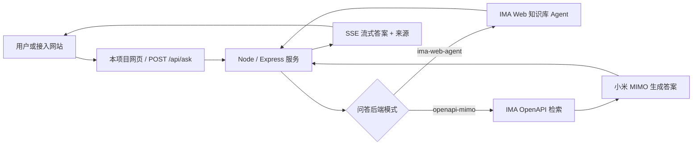
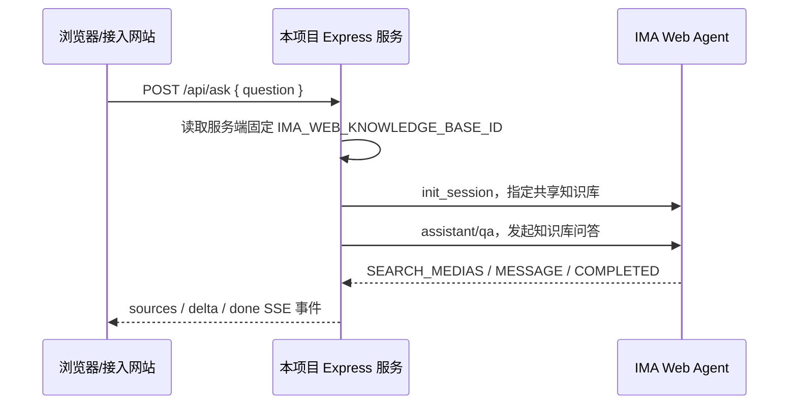
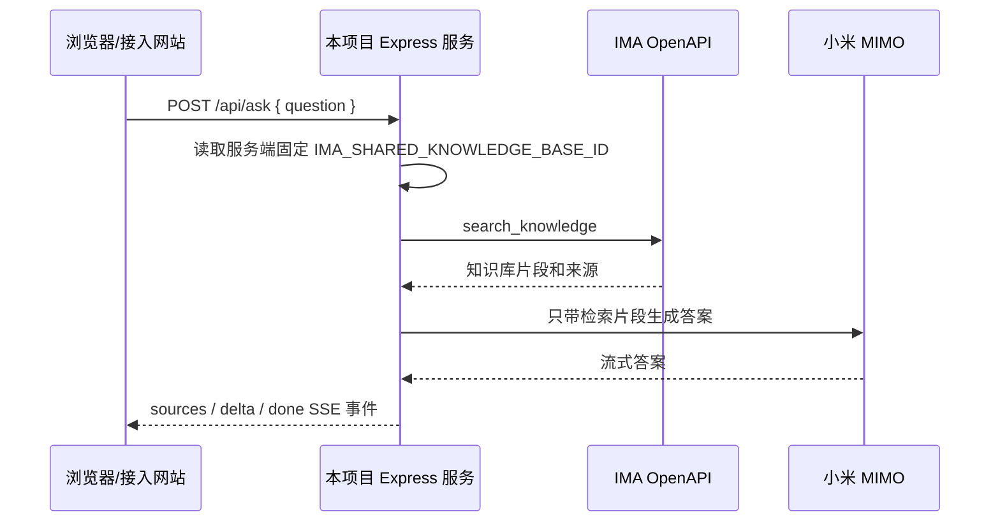

# IMA Shared Knowledge Base QA Web App

这是一个把 IMA 共享知识库问答能力接到网页里的轻量服务。用户在网页里提问，服务端只访问一个固定知识库，然后把答案流式返回给浏览器或其他网站。

这个项目不做知识库管理，也不让前端选择知识库。知识库 ID 必须在服务端环境变量里配置好，避免调用方随意切库。

## 一句话架构



## 两种模式怎么选

| 模式 | 适合谁 | 优点 | 代价 |
| --- | --- | --- | --- |
| `ima-web-agent` | 想尽量对齐 IMA 网页版共享知识库问答体验的人 | 复用 IMA 网页自己的知识库 Agent，召回更积极，答案质量更接近 IMA | 依赖 IMA 网页登录态，需要维护 cookie / refresh token |
| `openapi-mimo` | 想稳定部署到普通服务器、尽量使用官方 API 的人 | 只需要 IMA OpenAPI 凭证和 MIMO API Key，更像常规后端服务 | 受 IMA OpenAPI 可返回内容限制，某些 IMA 网页能读到的原文 OpenAPI 不一定能取到 |

当前本地调试和高质量版本默认用 `ima-web-agent`。如果要给别人开源部署，建议文档里把 `openapi-mimo` 作为更稳的官方部署路径，把 `ima-web-agent` 标注为“高质量但需要登录态维护”的私有适配路径。

## 凭证先讲人话

这个项目会用到三类凭证：

| 凭证 | 谁提供 | 用在哪里 | 是否必须 |
| --- | --- | --- | --- |
| IMA Web 登录态 | 能登录目标 IMA 账号的人 | `ima-web-agent` 模式，让服务端模拟 IMA 网页问共享知识库 | 只在 `ima-web-agent` 模式必须 |
| IMA OpenAPI 凭证 | IMA 开放接口后台 | `openapi-mimo` 模式，用来搜索固定共享知识库 | 只在 `openapi-mimo` 模式必须 |
| 小米 MIMO API Key | 小米 MIMO / OpenAI-compatible 平台 | `openapi-mimo` 模式，用检索片段生成答案 | 只在 `openapi-mimo` 模式必须 |

还有两类不是外部平台凭证，但生产环境建议配置：

| 配置 | 作用 |
| --- | --- |
| `IMA_QA_API_TOKEN` | 给 `/api/ask` 加一层 Bearer Token，适合服务器到服务器调用 |
| `ALLOWED_ORIGINS` | 限制哪些网页域名能从浏览器跨域调用这个服务 |
| `IMA_QA_MAX_CONCURRENT_ASK` | 限制同一实例同时跑多少个上游问答，保护 IMA 和 MIMO |
| `IMA_QA_QUEUE_LIMIT` | 并发满时最多排队多少个请求，队列满返回 429 |

详细部署和凭证说明见 [docs/DEPLOYMENT.md](docs/DEPLOYMENT.md)。

## 两个知识库 ID 不要混用

IMA 网页和 IMA OpenAPI 看到的知识库 ID 可能不是同一种格式：

| ID | 用在哪个模式 | 长什么样 | 说明 |
| --- | --- | --- | --- |
| `IMA_WEB_KNOWLEDGE_BASE_ID` | `ima-web-agent` | 通常是数字字符串 | IMA 网页 URL / 网页请求里用的知识库 ID |
| `IMA_SHARED_KNOWLEDGE_BASE_ID` | `openapi-mimo` | OpenAPI 返回的共享知识库 ID | IMA OpenAPI 搜索接口用的知识库 ID |

这两个值不能凭感觉互相替换。填错后最常见的表现是：服务能启动，但检索不到正确资料，或者回答质量明显不像目标共享知识库。

## 方案 A：IMA Web Agent 模式

这个模式相当于服务端帮你打开 IMA 网页里的“@共享知识库后提问”能力。



最小环境变量：

```env
IMA_QA_PROVIDER=ima-web-agent
IMA_WEB_KNOWLEDGE_BASE_ID=your_ima_web_numeric_kb_id
IMA_WEB_AGENT_HEADERS_JSON={"x-ima-cookie":"...","x-ima-bkn":"..."}
IMA_WEB_AGENT_MODEL_ID=official_3
IMA_WEB_AGENT_MODEL_TYPE=3
```

登录态维护变量：

```env
IMA_WEB_AGENT_RUNTIME_ENV_PATH=/absolute/path/to/runtime/ima-web-agent.env
IMA_WEB_AGENT_TOKEN_EXPIRES_AT=1785257551943
IMA_WEB_AGENT_REFRESH_TOKEN_EXPIRES_AT=1787842056525
IMA_WEB_AGENT_REFRESH_SKEW_MS=600000
IMA_WEB_AGENT_REFRESH_INTERVAL_MS=60000
```

这些字段的含义：

| 变量 | 含义 | 维护说明 |
| --- | --- | --- |
| `IMA_WEB_KNOWLEDGE_BASE_ID` | IMA 网页里这个共享知识库的数字 ID | 这是服务端唯一允许访问的知识库，不要从前端传 |
| `IMA_WEB_AGENT_HEADERS_JSON` | IMA 网页登录态请求头，主要是 `x-ima-cookie` 和 `x-ima-bkn` | 是秘密，不能提交、截图、写日志 |
| `IMA_WEB_AGENT_TOKEN_EXPIRES_AT` | 短 token 到期时间，毫秒时间戳 | 一般约 2 小时有效，用来提前刷新 |
| `IMA_WEB_AGENT_REFRESH_TOKEN_EXPIRES_AT` | refresh token 到期时间，毫秒时间戳 | 一般约 30 天，到期后必须重新登录 IMA Web |
| `IMA_WEB_AGENT_RUNTIME_ENV_PATH` | 刷新登录态后回写到哪个本地 env 文件 | 推荐放在 gitignored 的 `runtime/` 目录 |
| `IMA_WEB_AGENT_REFRESH_SKEW_MS` | 提前多久刷新短 token | 默认 10 分钟 |
| `IMA_WEB_AGENT_REFRESH_INTERVAL_MS` | 后台多久检查一次 token | 默认 1 分钟 |

接手人一般不需要手写 `IMA_WEB_AGENT_HEADERS_JSON`。更推荐由维护者从已登录 IMA Web 的浏览器会话生成一份 `runtime/ima-web-agent.env`，再放到服务器安全目录里。这个文件等价于登录态，权限建议 `600`。

## 方案 B：IMA OpenAPI + 小米 MIMO 模式

这个模式更像传统 RAG：先用 IMA OpenAPI 搜索共享知识库，再把检索到的片段交给小米 MIMO 生成答案。



最小环境变量：

```env
IMA_QA_PROVIDER=openapi-mimo
IMA_OPENAPI_CLIENTID=your_ima_client_id
IMA_OPENAPI_APIKEY=your_ima_api_key
IMA_SHARED_KNOWLEDGE_BASE_ID=your_shared_knowledge_base_id
MIMO_BASE_URL=https://token-plan-cn.xiaomimimo.com/v1
MIMO_API_KEY=your_mimo_api_key
MIMO_MODEL=mimo-v2.5
```

这些字段的含义：

| 变量 | 含义 | 维护说明 |
| --- | --- | --- |
| `IMA_OPENAPI_CLIENTID` | IMA OpenAPI 应用 Client ID | 和 API Key 配套使用 |
| `IMA_OPENAPI_APIKEY` | IMA OpenAPI 应用密钥 | 是秘密，不能进 git |
| `IMA_SHARED_KNOWLEDGE_BASE_ID` | IMA OpenAPI 里的共享知识库 ID | 服务端固定使用，不允许前端覆盖 |
| `MIMO_BASE_URL` | 小米 MIMO 的 OpenAI-compatible 地址 | 默认 `https://token-plan-cn.xiaomimimo.com/v1` |
| `MIMO_API_KEY` | 小米 MIMO API Key | 是秘密，不能进 git |
| `MIMO_MODEL` | 生成答案的模型名 | 默认 `mimo-v2.5` |

如果接手人只想“先跑起来”，优先让他准备 `openapi-mimo` 这一组。它不需要浏览器登录态，也更符合常规服务器部署习惯。

## 本地运行

```bash
cd apps/ima-qa-web
npm install
cp .env.example .env
npm start
```

默认页面：

- `http://localhost:3000/`
- `http://localhost:3000/embed.html`

Docker / Linux / Nginx 部署见 [docs/DEPLOYMENT.md](docs/DEPLOYMENT.md)。

## API

流式调用：

```http
POST /api/ask
Accept: text/event-stream
Content-Type: application/json

{
  "question": "问题",
  "history": [{ "role": "user", "content": "上一轮问题" }]
}
```

SSE 事件：

| 事件 | 含义 |
| --- | --- |
| `sources` | 本轮检索到的来源列表 |
| `delta` | 答案片段 |
| `done` | 回答结束 |
| `error` | 用户可见错误 |

如果配置了 `IMA_QA_API_TOKEN`：

```http
Authorization: Bearer your_server_token
```

注意：如果直接把本项目网页公开给普通用户，不要把 `IMA_QA_API_TOKEN` 写进前端 JavaScript。这个 token 更适合“你的业务后端调用本服务”，或者由反向代理统一加鉴权。

## 公网多人访问策略

默认策略是 **单问单答、服务端不保存用户上下文**。每个请求都有自己的 `requestId`、来源列表、答案流；`ima-web-agent` 模式下每次提问都会新建 IMA session，不复用上一位用户或上一轮问题。

上线初期建议按 10 以内并发配置：

```env
IMA_QA_MAX_CONCURRENT_ASK=1
IMA_QA_QUEUE_LIMIT=30
IMA_QA_REQUEST_TIMEOUT_MS=180000
IMA_QA_RATE_LIMIT_WINDOW_MS=60000
IMA_QA_RATE_LIMIT_MAX=20
TRUST_PROXY=true
IMA_QA_HEALTH_DETAILS=basic
```

含义：

| 变量 | 默认值 | 说明 |
| --- | --- | --- |
| `IMA_QA_MAX_CONCURRENT_ASK` | `1` | 同一实例最多同时处理 1 个上游问答；Web Agent 单登录态建议串行，OpenAPI/MIMO 可压测后调高 |
| `IMA_QA_QUEUE_LIMIT` | `30` | 并发满后最多排队 30 个请求 |
| `IMA_QA_REQUEST_TIMEOUT_MS` | `180000` | 单个请求总超时时间，包含排队时间 |
| `IMA_QA_RATE_LIMIT_WINDOW_MS` | `60000` | 限流窗口 |
| `IMA_QA_RATE_LIMIT_MAX` | `20` | 每个 IP 每分钟最多 20 次 |
| `TRUST_PROXY` | `false` | 部署在 Nginx/CDN 后面时设为 `true`，按 `X-Forwarded-For` 识别真实 IP |
| `IMA_QA_HEALTH_DETAILS` | `basic` | 默认只展示队列/限流状态；设为 `auth` 才展示 Web Agent token 剩余时间 |

## 维护要点

- `.env`、`runtime/`、IMA cookie、refresh token、IMA API Key、MIMO API Key 都不能提交。
- `/healthz` 只显示脱敏状态，比如 provider、model、token 剩余时间，不显示真实 token。
- 公网部署时保留并发池、队列、限流和超时；`ima-web-agent` 同一登录态建议串行访问，超过 50 并发要优先评估 `openapi-mimo`、上游限流和横向扩展。
- Web Agent 模式不维护自己的向量库。知识库新增内容后，等 IMA 自己索引完成即可。
- 如果答案看起来过旧，先在 IMA 网页里用 `@共享知识库` 问同一个问题对照；如果 IMA 网页是新的、本项目还是旧的，再重启服务。
- 如果 IMA Web 私有接口变更，临时切回 `openapi-mimo` 是最稳的降级方案。

## Verify

```bash
npm test
```
