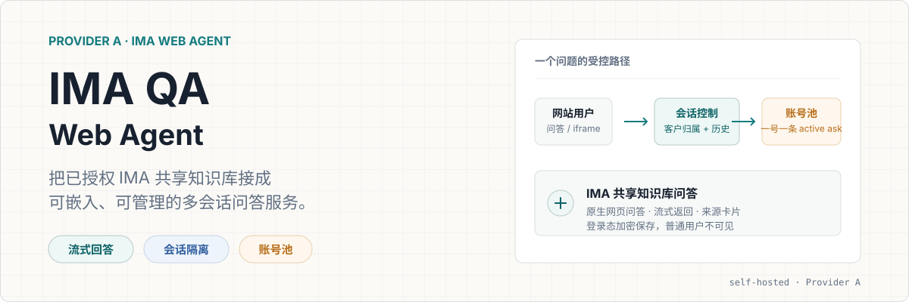
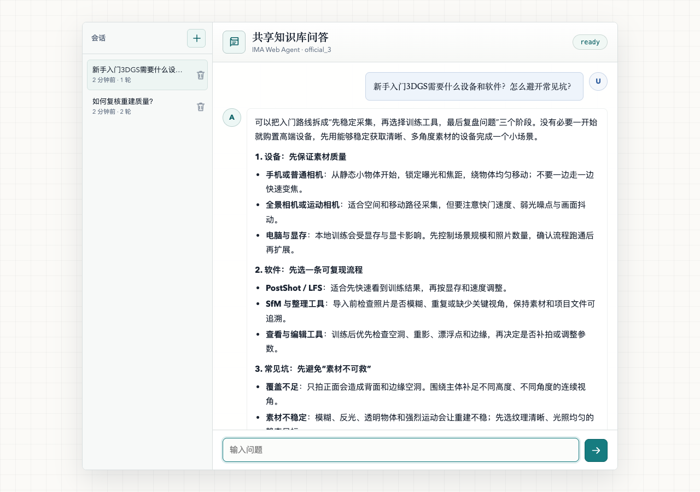
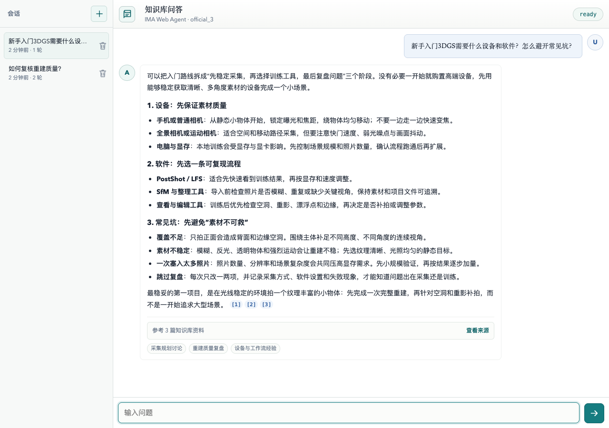
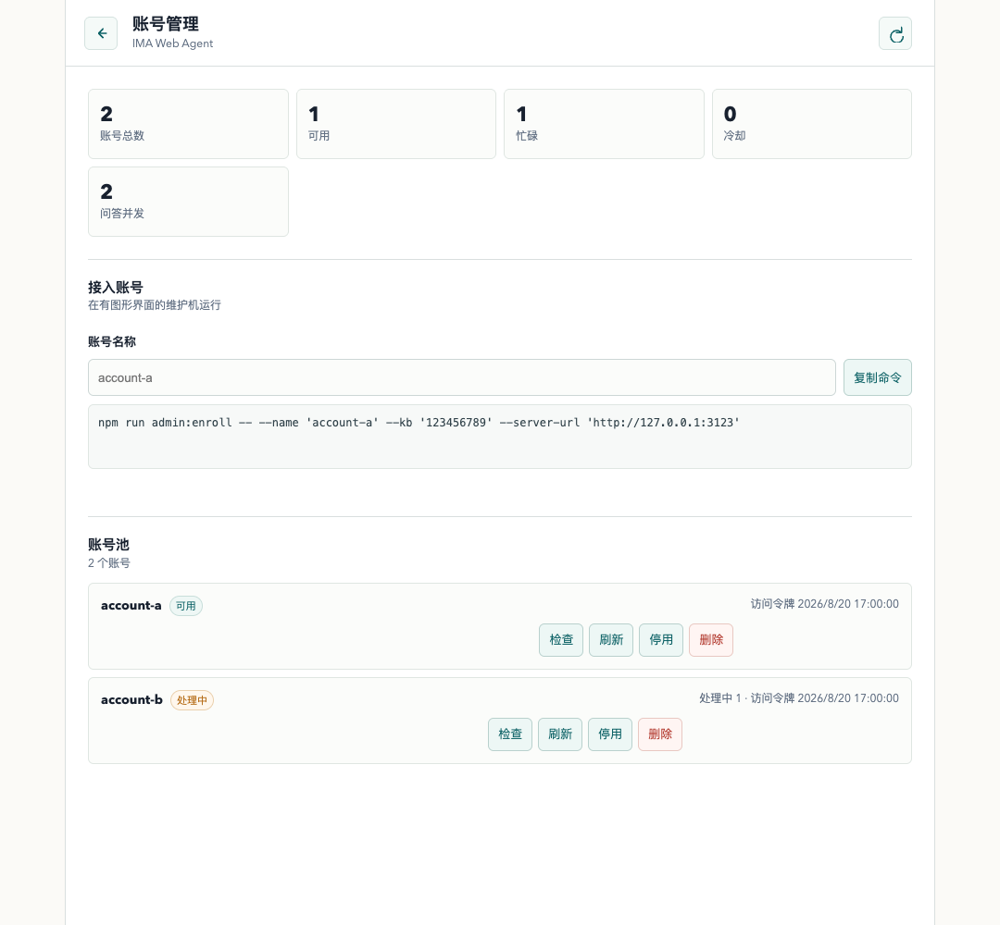
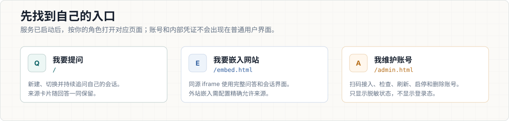
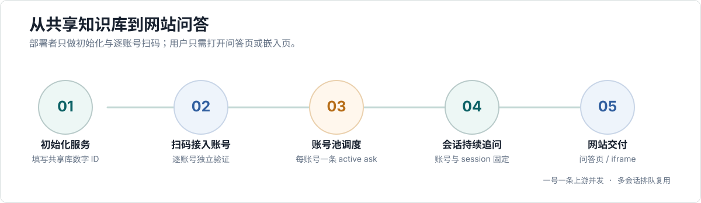

<p align="center">
  
</p>

<p align="center">
  <a href="#推荐安装入口"><strong>开始部署</strong></a>
  &nbsp;·&nbsp;
  <a href="#账号接入"><strong>接入账号</strong></a>
  &nbsp;·&nbsp;
  <a href="#会话与账号池"><strong>理解会话与并发</strong></a>
  &nbsp;·&nbsp;
  <a href="#账号池并发演练"><strong>演练账号池</strong></a>
  &nbsp;·&nbsp;
  <a href="./docs/DEPLOYMENT.md"><strong>部署文档</strong></a>
  &nbsp;·&nbsp;
  <a href="./docs/ACCEPTANCE_TESTING.md"><strong>部署后验收</strong></a>
  &nbsp;·&nbsp;
  <a href="./CHANGELOG.md"><strong>更新日志</strong></a>
</p>

> 一个面向网站交付的 IMA 共享知识库问答服务。它通过**已授权账号**调用 IMA 网页端能力，提供流式回答、可持续追问的会话、来源卡片和可维护的账号池。

这份发布包只包含 **Provider A: IMA Web Agent**。部署它不需要 IMA OpenAPI、MIMO Key、本地语料或本地索引；启动时若配置成其他 Provider，会明确拒绝运行，避免交付时误走另一条链路。

> 本次稳定版本为 **v0.5.0**，承接已发布 v0.5.0-rc.1 的持久问答任务能力；安装前核对 [Releases](https://github.com/19Chris19/ima-qa-web-agent/releases/latest) 的实际发布状态与附件镜像清单。
> 参见[任务接口与恢复边界](./docs/DURABLE_QA_TASKS.md)：断开观看不取消任务，
> 内置问答页要求 `durable_qa_tasks_v1`，旧接口继续兼容。
> Node 与 Docker 使用同一固定版本；知天下 v0.3.0 配套本版本，不自动替换已有安装。
> 发布、Air 割接与真实问答证据分别记录；本次未额外发送真实 IMA 问题。
> 最新发布与运行状态、健康检查抖动及剩余门槛见[2026-10-10 验收记录](./docs/RELEASE_ACCEPTANCE_20261010.md)。

灰度升级与回退见[预发布升级说明](./docs/PRERELEASE_UPGRADES.md)。

## 它看起来怎样

> v0.4.2 为稳定版，v0.5.0-rc.1 为受邀灰度版；合并、发布与各安装的实际升级是独立动作。后台保留展开式账号列表，直接显示知识库问答状态、登录状态和实际维护时间，维护操作无需打开详情抽屉；详见[管理体验](./docs/ADMIN_EXPERIENCE.md)、[维护合同](./docs/ACCOUNT_MAINTENANCE.md)及[重新登录身份处理](./docs/ACCOUNT_ENROLLMENT.md)。下方截图为此前版本的合成演示，不是本版本逐像素验收证据。

本版本还包含[通用问答交互](./docs/QA_EXPERIENCE.md)与[离线账号迁移工具](./docs/ACCOUNT_TRANSFER.md)。工具成功仅代表新增账号以停用状态导入，不代表来源调度已经退出或账号问答资格通过；发布和割接前必须逐项检查[候选验收记录](./docs/MANAGEMENT_CANDIDATE_ACCEPTANCE.md)。



上图使用的是**合成演示数据**，用来公开展示界面和信息层级，避免泄露任何共享知识库原文或真实会话。实际服务会使用你自行接入、且合法加入目标共享知识库的 IMA 账号完成问答。

<p align="center">
  
  
</p>

左图是可嵌入网站的完整问答界面；右图是仅给维护者使用的账号管理页。两张图同样使用合成账号、来源和状态数据，不含 cookie、token、共享库 ID 或真实历史。

## Agent 一键部署与扫码引导

v0.4.2 将扫码助手纳入安装流程；v0.4.1 不具备本节的统一引导入口。完整命令、桌面/服务器区别与验收状态见 [Agent 部署说明](./docs/AGENT_DEPLOYMENT.md)。安装前确认该版本已有正式 Release 和对应镜像。

把仓库链接、你的官方知识库分享链接与下面提示词交给 Agent：

> 请部署此仓库最新已发布稳定版本，先阅读 README 和 docs/AGENT_DEPLOYMENT.md。检查系统、Docker、端口及已有安装，使用仓库引导工具完成配置与扫码通路。不要输出凭证、覆盖数据或开放管理接口。打开官方 IMA 窗口前提醒我账号必须加入目标知识库；需要扫码、手机确认、加入知识库或系统授权时暂停。处理后继续验证，报告版本、访问地址、接入状态、未通过项目和恢复方式。真实问答须先说明并授权，不仅凭健康检查宣布成功。

## 先找到自己的入口



- **普通用户**打开 `http://127.0.0.1:3117/`：提问、管理自己的会话并继续追问。
- **网站接入者**使用 `http://127.0.0.1:3117/embed.html`：在网站中嵌入完整问答界面。
- **服务维护者**打开 `http://127.0.0.1:3117/admin.html`：使用管理员 token 接入、检查和维护账号。

> [!IMPORTANT]
> 公开仓库只包含源码、配置模板、文档和合成演示资产。`.env`、`runtime/`、浏览器 profile、账号库密钥、cookie、refresh token、共享库原文和真实会话必须一直保持私有。

## 它解决什么

IMA QA Web Agent 适合这样的场景：你已经有一个 IMA 网页共享知识库，希望把其中的问答能力以自己的网站页面或 iframe 交付给用户，同时需要可靠地管理多个已授权账号。

- 用户在问答页提问，得到流式答案和精选来源。
- 用户可以新建、切换、删除会话，并在 7 天默认保留期内持续追问。
- 网站可以同源嵌入 `/embed.html`，保留完整会话体验。
- 维护者在 `/admin.html` 查看账号可用性、冷却状态和登录续期情况。
- 每个账号只稳定承接一条上游问答；多账号让更多用户并行，不让同一个 IMA 登录态被并发挤压。

## 工作方式



服务端会为每个客户的会话固定 IMA 账号和 IMA session。后续追问仍走同一个上游 session，因此能延续上下文；不同客户的会话、历史、来源和上游 session 不会互相混用。

## 推荐安装入口

**新安装只推荐 [Agent 统一引导](./docs/AGENT_DEPLOYMENT.md)。**准备官方知识库分享链接、Docker/Compose、Git 和可扫码的维护电脑即可，不要求手工寻找数字 ID。工具负责服务配置、匹配版本的维护浏览器及扫码通路；人完成扫码、手机确认和必要的知识库加入。

新安装选择最新已发布稳定 Release；本版本为 v0.5.0，固定 tag、源码与附件镜像摘要。v0.5.0-rc.1 保留为历史预发布，不修改旧 tag。若 v0.5.0 尚未发布，不把 main 当作已发布版本。已验证平台见对应 Release 及[安装验收记录](./docs/ONBOARDING_ACCEPTANCE.md)。

标准部署输入是固定 Git tag 的检出，或该 tag 的完整源码归档，必须包含 `package-lock.json`；候选演练同样固定到已审查提交。npm tarball 不推荐作为独立部署目录：它不包含该锁文件，不能直接用于引导脚本的 `npm ci` 或源码 Docker 构建。不要临时生成锁文件代替发布版本的依赖锁定。

| 场景 | 推荐路径 |
| --- | --- |
| Mac / Windows 桌面 Docker | 引导器准备专用浏览器，管理页“接入账号”打开官方 IMA 窗口 |
| 无桌面 Linux 服务器 | 服务端 Docker；维护电脑通过受保护的 SSH 通路扫码 |
| 已安装的 Node / Docker 服务 | 保留配置，按[高级手工部署](./docs/DEPLOYMENT.md)维护，不重新初始化 |

容器只运行服务，专用浏览器在维护电脑上。登录验证通过后凭证加密存入服务端账号库，普通问答不依赖浏览器窗口。Windows 真机、远程 Linux 与新账号端到端验收状态见[候选记录](./docs/ONBOARDING_ACCEPTANCE.md)，不要把方案支持等同于已经验收。

Provider A 可以独立提供通用问答页，也能作为品牌网站和机器人的后端。部署知天下等完整网站产品，应从对应网站仓库的整套部署入口开始，由其选择配套 Provider，不必先手工部署两个项目。两仓不共享运行目录；网站的普通、服务和管理员凭证用途分开。

生产环境不直接开放管理端口，域名和 HTTPS 见 [反向代理说明](./docs/DEPLOYMENT.md#nginx)。手工 Node、数字 ID 初始化和旧版镜像路径属于高级部署，不是引导流程缺少的必做步骤。

## 账号接入

运行中的服务通过“受控浏览器接入”保存账号登录态。优先打开 `/admin.html`，输入管理员 token 后点击“接入账号”：填写名称后，服务默认打开独立、可见的 IMA 临时浏览器；在该窗口内只使用待接入账号扫码并完成手机确认。真实问答验证须事先说明并获维护者授权；扫码、手机确认或加入知识库由人完成，Agent 不代办。共享知识库授权通过后，加密保存登录态，首次写入即为待 QA 验证停用，关闭临时窗口；刷新账号池不等于启用。已声明的一次 QA 验证成功后才原子提交资格并释放待验证门禁，手动/迁移停用不自动解除。**每次接入不使用维护机已登录微信的快捷登录。**

管理页负责显示脱敏阶段、聚焦受控窗口、取消任务和成功回执；它不会把页面截图中的二维码当作默认登录通道。授权通过前不持久保存捕获的登录态；结束时清理二维码、临时浏览器 profile 和内存捕获状态。已保存后的 QA 验证失败、取消或超时会保留加密登录态并保持停用，可显式重试一次 QA，无需重新扫码（凭证失效除外）。运行期不依赖浏览器窗口。需要排查嵌入二维码问题时，维护者可显式设置 `IMA_WEB_AGENT_ENROLLMENT_BROWSER_MODE=background`。

账号池按扫码后取得的 IMA 登录身份做服务端不可逆指纹去重，不以维护者填写的名称作为身份依据。同一 IMA 账号不能通过更换名称占用额外并发；旧账号库中发现的重复身份会自动停用并在管理页标记，保留原记录供维护者确认后删除。

引导安装的桌面 Docker 通过专用助手打开官方窗口；纯 Linux 在维护电脑上扫码。旧的原生 Node 方式仍可通过 `IMA_WEB_AGENT_BROWSER_PATH` 配置浏览器，但不是新安装的默认路线。未通过扫码通路预检时先修复，不因服务启动就认为账号接入已可用。

CLI 是兼容兜底方式：

```bash
npm run admin:enroll -- \
  --name account-a \
  --server-url http://127.0.0.1:3117
```

命令会按顺序完成：

1. 校验管理员 token、账号名称和目标共享知识库。
2. 打开与其他账号隔离的临时浏览器窗口。
3. 由维护者只使用待接入账号扫描二维码，并确认账号已经加入目标共享库。
4. 核验目标共享知识库的明确成员授权；session 初始化成功不能代替权限证明。未加入时由人在官方页面处理，再继续验证；网络故障显示无法确认，不猜测权限。
5. 授权核验通过后加密保存登录态，首次写入为待验证停用，并关闭浏览器；授权未通过则不保存。CLI 不自动执行真实问答，保存后需在管理页单独授权一次 QA 验证，成功提交资格后才能调度；QA 失败、取消或超时保留已保存登录态和停用状态。

继续增加账号时，只换一个未使用的名称：

```bash
npm run admin:enroll -- \
  --name account-b \
  --server-url http://127.0.0.1:3117
```

同名账号默认拒绝覆盖。确定要重新扫码绑定时，显式添加 `--replace`。服务器没有图形界面时，通过 SSH 隧道在维护机扫码，见 [远程服务器 + 本机扫码](./docs/DEPLOYMENT.md#远程服务器--本机扫码)。

## 会话与账号池

### 会话如何保持追问

- 一个客户可以拥有多个会话；点击“新建会话”不会删除旧记录。
- 同一会话的追问持续使用它已绑定的 IMA 账号和 IMA session。
- 会话历史与最多 10 条精选来源会一同保留，默认 TTL 为 7 天，可用 `IMA_QA_CONVERSATION_TTL_MS` 覆盖。
- 浏览器直连使用 HttpOnly 客户端标识；客户后端代理时，应为每位已登录用户传不同的 `X-IMA-Client-Id`。
- 非归属客户、未知或过期会话一律返回 404，不暴露账号池、内部 session 或其他用户历史。

### 账号数和并发是什么关系

稳定基线是：**一个账号同一时刻只处理一条 IMA 问答**。在默认 `auto` 容量模式下，账号池容量会跟随可调度账号数自动变化：两个可用账号可承接两条上游问答。新接入账号仅保存登录态不会增加容量；通过资格门禁、启用并成功同步到池后才增加容量，正常同步不需要重启。

多个会话可以映射到同一账号，但同一时间会排队使用该账号。这样既能保持多轮上下文，也避免将并发请求压入同一个 IMA 登录态。不要把“账号数”理解为无限并发承诺；IMA 的限流、登录态和风控仍由上游决定。

| 状态 | 服务行为 |
| --- | --- |
| 账号可用 | 按最近最少使用原则调度新的会话 |
| 账号忙碌 | 同账号后续请求排队，不并发复用 active ask |
| IMA 限流或“提问太快” | 该账号进入冷却，其他可用账号继续处理 |
| 登录失效或共享库权限失效 | 该账号停止调度，已有会话不偷偷迁移，维护者重新接入该账号 |

### 账号池并发演练

`/admin.html` 的“并发演练”直接验证真实 IMA 端到端能力，不需要手工同时点击多个浏览器窗口。它从内置 3DGS 评测题库生成可编辑脚本，并为每位模拟客户建立独立会话：首问同批提交，成功后再以同一 IMA 账号和上游 session 发起一条追问。

- **基线并发**：模拟客户数等于当前可用且身份独立的账号数，确认每个账号实际提供一条稳定并发。
- **排队压力**：模拟客户数等于可用账号数的两倍，确认队列最终清空、追问不中断且失败按登录、限流、网络或超时分类。
- **自定义**：可配置 `1-30` 位模拟客户并改写首问和追问；问题应与当前共享知识库相关，否则质量结论没有意义。

内置题库当前有 50 道 3DGS 问题。一次生成时自动分配不重复；若将来题库小于模拟客户数，剩余客户的首问会留空并明确要求手写，不会循环复用题目。脚本中的模拟客户、首问和追问可以逐条展开或收起，也可以一次性全部展开或收起。

演练会产生真实 IMA 问答调用。为避免混入普通用户流量，它仅在普通队列为空时启动，期间普通 `/api/ask` 会明确返回 `503`，完成、取消或服务重启后自动恢复。演练不会刷新、导出或覆盖账号凭证，也不会写入普通客户的七天会话历史。

结果按“一个模拟用户一问一答”展示：精选来源、检索摘要、排队耗时、首段响应耗时、总耗时、账号显示名和隔离检查都可复核。每位模拟客户及其首问/追问都可独立展开或收起，报告提供全局展开、全局收起和关闭当前复核视图。质量评分由维护者按相关性、完整性、来源可信度和追问连贯性各 `0-2` 分填写，系统不伪造质量分。脱敏报告只保存在被 Git 忽略的 `runtime/` 中，默认保留 7 天，可下载 JSON 或手动删除。

## 网站嵌入与 API

同源网站直接嵌入完整体验：

```html
<iframe
  src="/embed.html"
  style="width: 100%; height: 640px; border: 0"
  title="共享知识库问答"
></iframe>
```

外站 iframe 与前端直调 API 时，在 `.env` 的 `ALLOWED_ORIGINS` 中配置精确的 `https://` 业务域名，并使用 Nginx 反代。SSE 需要关闭 buffering；反代、CORS、CSP 和 API token 的完整规则在 [部署文档](./docs/DEPLOYMENT.md#nginx)。

需要自定义网站页面时，先运行[最小网页后端示例](./examples/web-bff/README.md)（默认合成模式，无需账号或凭证），再按[网页后端接入合同](./docs/WEB_BFF_CONTRACT.md)接入已配置的 Provider A。可信后端应先确认容量接口声明 `knowledge_agent_keyed_sse_v1`，不能仅凭服务连通或账号数判断协议可用。浏览器只连自己的网站后端；受保护的 `/internal/` 路由只能由可信后端访问，**不能**通过 Nginx 暴露到公网。

Provider A 是可独立部署的问答服务，不是业务网站的代码仓库。知天下等品牌网站可在自己的私有仓库维护页面、身份和业务后端，并按发布 tag 固定兼容版本；这里不包含其 Logo、题库、账号或运行数据。两者通过接口而非共享账号目录连接：

```text
浏览器 → 业务网站前端 → 业务网站后端 (BFF) → Provider A → IMA
                                    ├─ 普通 token：会话历史
                                    └─ 服务 token：原生 Agent 容量与流式问答
```

直接嵌入 `/embed.html` 无需另做 BFF。自定义网站应在自己的 README 写明所用 Provider A tag、接入合同版本和升级验收结果；不能把 Provider A 的管理员 token 当作业务凭证。

## 二次开发示例：消息机器人

仓库附带一个只在终端运行的适配器示例，展示如何把不同用户的消息映射到各自会话，再向 Provider A 请求答案：

```bash
node examples/bot-adapter/run.mjs
```

默认使用合成回答，不需要账号、网络或 API 凭证。准备好 Provider A 服务后，可在受信任的后端设置 `PROVIDER_A_URL` 和 `PROVIDER_A_SERVICE_TOKEN`，使用 `node examples/bot-adapter/run.mjs --real` 发起真实问答。该示例调用服务端的容量接口和受保护的深查接口；服务 token 不进入浏览器。

示例不接入微信或 Android，也不包含平台消息收发。它演示用户隔离、同一用户串行沿用会话、容量读取和保守的重复消息处理。每条平台消息使用稳定消息 ID 调用 Provider A 的持久幂等接口；机器人本身仍需持久保存消息处理状态，并对平台回复做去重。架构、事件与失败状态见 [机器人适配契约](./docs/BOT_ADAPTER.md)。

## 维护与验证

首次部署或升级到 v0.4.0 时，请按[部署与真实验收指南](./docs/ACCEPTANCE_TESTING.md)使用独立目录、配置和端口完成扫码、知识库问答、来源、追问及重启恢复检查。代码测试通过不等于已经对真实 IMA 账号或上游完成验收。

### 日常查看

打开 `/admin.html`，输入私有 `.env` 中的 `IMA_QA_ADMIN_TOKEN`。管理页只显示脱敏状态，支持：

- 查看可用、忙碌、冷却和停用账号数。
- 查看令牌到期时间、最近错误和使用状态。
- 对单个账号做健康检查、刷新、启用、停用或删除。
- 打开独立官方 IMA 窗口供人工扫码接入或重新登录；管理页显示阶段、聚焦窗口、取消及回执，不默认在当前页面生成二维码。
- 对已保存的待验证账号显式授权一次 QA 验证；普通查看、健康检查和启用操作不代替资格验证。

普通问答页、嵌入页和管理响应都不会返回 cookie、refresh token、账号加密密钥、上游 session ID 或内部账号凭证。

### 发布前验证

```bash
npm test
curl http://127.0.0.1:3117/healthz
```

并发和会话隔离应使用脚本验证，而不是手动同时点击：

```bash
npm run test:concurrency -- \
  --base-url http://127.0.0.1:3117 \
  --concurrency 2 \
  --follow-up
```

## 常见问题

### 为什么扫码后账号没有进入池？

先区分“登录态尚未保存”和“已保存但不可调度”。配置共享链接的流程须有目标知识库的明确成员授权，初始化 session 成功不能替代授权，更不能替代 QA 资格。扫码未完成、授权等待批准或无法确认时，先在官方窗口处理并继续验证，不猜测权限。

授权通过后登录态以待验证停用状态保存，classic 与 knowledge-agent 都不可调度。管理页已声明的单次 QA 或后续显式重试成功后，才以绑定身份、凭证及状态的 CAS 原子提交资格；CLI 和运行态文本导入不会自动发起 QA。未提交资格时的失败、取消或超时保留已保存登录态和停用状态，普通启用不能绕过；手动/迁移停用也不会被迟到验证解除。这不是所有入口的新 proof 要求，启动 `env-seed` 保留既有兼容行为。

同时检查回执的 `commitApplied` 和 `warning`：`commitApplied=true` 且 `warning=pool_sync_failed` 表示资格已提交但本机仍隔离，不能称为“取消并撤销启用”；取消不会撤销已提交资格，需要暂停请显式停用。同步故障须先核对并按[账号接入说明](./docs/ACCOUNT_ENROLLMENT.md)恢复，不自动重新提问。登录/授权默认五分钟与保存后单次 QA 默认六十秒是独立期限，`expiresAt` 不是总截止时间。

### 我在维护机退出 IMA，会立刻让服务失效吗？

不会立刻失效。运行期使用服务端加密账号库中的登录态和 refresh token，不依赖接入时的临时浏览器 profile。上游最终的 token 时长与风控由 IMA 决定；refresh 失败或权限失效时，只需重新接入受影响账号。

### 为什么两位用户的请求有时会排队？

同一账号固定一条 active ask。账号池在保持上游会话独立与稳定的前提下调度空闲账号；当所有账号都忙碌时，后续请求进入 FIFO 队列。增加已授权账号增加的是总并发容量。

### 为什么要保留 7 天会话？

7 天是试用阶段的默认平衡：用户能持续追问，服务端又不会无限保存历史。可以设置 `IMA_QA_CONVERSATION_TTL_MS` 调整。达到多实例部署或超过 5 个账号前，建议迁移到 Redis/PostgreSQL 和分布式锁。

### 可以把账号登录态、运行目录或真实问答截图提交到 GitHub 吗？

不可以。`.env`、`runtime/`、浏览器 profile、cookie、refresh token、账号库密钥、共享库原文、真实会话历史和运行日志都必须保持私有。发布前检查这些内容没有被 Git 跟踪。

## 深入阅读

- [部署与维护](./docs/DEPLOYMENT.md)
- [账号池策略与风控边界](./docs/WEB_AGENT_POOL_STRATEGY.md)
- [会话与账号池运行模型](./docs/SESSION_POOL_OPERATING_MODEL.md)
- [会话隔离架构](./docs/CONVERSATION_ARCHITECTURE.md)
- [人工体验场景](./docs/MANUAL_EXPERIENCE_SCENARIOS.md)
- [GitHub 发布和后续维护](./docs/GITHUB_RELEASE.md)

<details>
<summary><strong>高级私有集成：VoiceRAG 深查</strong></summary>

`apps/ima-voice-rag` 是主仓库中的独立实时语音入口。它仅在本地检索证据不足时，才可通过受保护的 `POST /internal/provider-a/deep-ask` 调用本服务。直接使用内置问答页的用户走公开 `/api/ask`；自定义网站的可信后端可按上面的合同使用受保护接口。

该语音集成不属于本 Provider A 独立发布包。可信的网站后端也可以按上面的接入合同使用受保护的原生问答流；直接嵌入页面仍使用普通网页入口。启用内部接口时须使用单独随机生成的 `IMA_QA_INTERNAL_SERVICE_TOKEN`，它必须与管理员 token、公开 API token 分离，且不得写入浏览器、日志或 Git。Nginx 必须拒绝 `/internal/` 路径。
</details>

## 许可

[MIT](./LICENSE)
