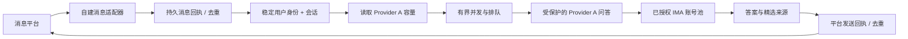

# 机器人适配契约

此接口供受信任的后端调用。微信消息接收、发送及 Android 控制由二次开发者自己实现，本仓库不含这些平台适配器。



Provider A 负责知识问答、会话隔离和上游账号调度；消息平台适配器负责平台用户映射、消息去重、排队策略及最终回复。两边使用稳定消息 ID 和每位用户独立的会话 ID 衔接。

## 消息路径

1. 按平台用户 ID 建立稳定的 `X-IMA-Client-Id`，不可用群 ID 代替用户 ID，除非产品明确让整个群共享一个会话。
2. 收到一条平台消息时生成稳定且唯一的 `Idempotency-Key`，例如平台消息 ID。用户身份、幂等键和规范化后的问题在重试期间必须保持一致。
3. 请求 `GET /internal/provider-a/capacity` 获取当前已验证账号容量及配置 generation。容量为 0 时等待容量通知或做有界轮询，不要并行派发更多问答。
4. 向 `POST /internal/provider-a/deep-ask` 发送 JSON 问题、该用户的 `conversationId`（首问省略）和两个请求头。成功响应中的 `conversationId` 由同一用户后续追问复用。
5. 将消息 ID、处理状态和返回平台的消息 ID 持久化在机器人自己的存储中。发送平台消息也要用平台支持的去重手段，防止“问答已成功、发送前崩溃”导致重复回复。

```http
Authorization: Bearer <IMA_QA_INTERNAL_SERVICE_TOKEN>
X-IMA-Client-Id: bot:<stable-user-key>
Idempotency-Key: <stable-platform-message-id>
Content-Type: application/json
```

```json
{
  "question": "请概括当前共享知识库中的主要主题",
  "conversationId": "conversation-id-from-previous-response"
}
```

首次请求返回 `success`、`answer`、`sources`、`conversationId` 和 `requestId`。完全相同的已完成请求会从该用户自己的持久会话恢复结果，并标注 `idempotentReplay: true`，不会再调 IMA。

## 重试和终态

- 相同键和相同请求正在本进程处理时，返回 HTTP `409`、`idempotencyState: processing`。稍后用原始请求重试。
- 相同键但问题或会话不同，返回 HTTP `409`、`idempotency_conflict`。修正客户端键管理；不要换问题复用一个消息 ID。
- 进程在上游完成状态不明时，回执进入 `unknown`。服务会拒绝再次派发，并要求调用方检查会话记录/人工处理，不承诺能判断 IMA 是否已实际完成。
- 已完成请求的去重期限默认 7 天。找不到已过期或已删除的原会话时，返回 HTTP `410`，不重新发送 IMA 请求。
- 带 `Idempotency-Key` 的内部请求仅支持 JSON 响应；SSE 请求返回 HTTP `400`。调用者应保存已接受、处理中、完成、未知和已回复等自己的业务状态。
- 用户取消、超时或连接断开后，不要自动用新键重发。用原键查询/重试；若结果未知，按未知终态处理。

## 安全与运行边界

- 两个 `/internal/` 接口依赖 `IMA_QA_INTERNAL_SERVICE_TOKEN`，只允许服务端内网访问；Nginx 不得向公网代理这些路径。
- Provider A 以 `X-IMA-Client-Id` 隔离会话和回执。机器人必须为每位真实用户生成稳定、不复用的标识。
- 带 `Idempotency-Key` 的内部问答会在 Provider A 的 `runtime/` 私有目录持久化回执，仅含身份哈希、请求哈希、会话定位、答案哈希和状态；不复制问题或回答。会话正文仍按 Provider A 会话策略存储。服务需配置持久会话目录，否则启用幂等键的内部请求会被拒绝。
- 当前为单实例本地 JSON 存储方案。多实例部署需先迁移至 Redis/PostgreSQL 并实现分布式锁与事务；不要让多个实例同时共享 JSON 文件。
- `examples/bot-adapter` 的本地内存回执只演示适配器流程，不替代消息平台侧的持久状态和发送去重；真实模式使用每条平台消息 ID 派生的稳定服务端幂等键。
