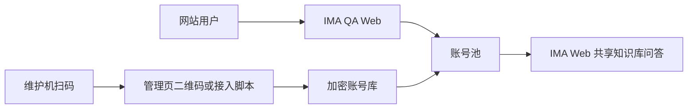

# Provider A 部署与维护

候选分支的部署后检查、真实 IMA 单账号验收和可选并发演练见[部署与真实验收指南](./ACCEPTANCE_TESTING.md)。请先在独立目录和端口验证，不要让候选实例与生产实例共用 `runtime/`。

## 运行模型



服务运行时不控制浏览器。浏览器只在逐账号接入时短暂打开，用来完成 IMA 官方登录；成功后服务提取必要登录态、验证共享库访问、关闭浏览器，并删除临时浏览器 profile。运行期使用加密账号库和 refresh token 维持登录态。

## 发布内容与排除内容

可以发布到 GitHub：源码、`package-lock.json`、Dockerfile、compose、`.env.example`、文档、测试和脚本。

严禁发布：`.env`、`runtime/`、`node_modules/`、浏览器 profile、账号库 key、cookie、refresh token、真实共享库内容、真实会话历史和运行日志。

Provider A 发布不需要：

- `IMA_OPENAPI_CLIENTID`、`IMA_OPENAPI_APIKEY`、`IMA_SHARED_KNOWLEDGE_BASE_ID`
- `MIMO_API_KEY`、`MIMO_MODEL`
- PDF、原始群聊资料或本地 RAG 索引

`npm start` 和 Docker 镜像均固定为 Provider A 入口；配置成其他 Provider 会在启动时明确失败，而不是悄悄切换到另一条问答链路。

## 初始化

### 先选择部署与扫码路径

Provider A 有两种支持的首次接入方式。它们使用同一套加密账号库和账号池，区别只在于“谁负责启动扫码浏览器”：

1. **桌面维护机原生运行**：Node 服务和 Chrome、Chromium 或 Ego Lite 在同一台有图形界面的维护机上运行。完成 `setup:provider-a` 后打开 `/admin.html`，管理页会打开独立的 IMA 登录窗口。这是本地试用和小规模维护最省步骤的路径。
2. **Docker 或纯 Linux 服务器**：服务运行在服务器，服务器只负责问答和存储，不包含桌面浏览器。维护者在自己的图形界面电脑上建立 SSH 隧道，再运行 CLI 接入；二维码和临时浏览器只在维护机上出现，凭证最终写入服务器账号库。见 [远程服务器 + 本机扫码](#远程服务器--本机扫码)。

不要在无 GUI 的 Docker/纯 Linux 服务端期待自动弹出浏览器窗口，也不要为了扫码把管理 API 暴露到公网。

### Docker 部署（服务器端）

```bash
git clone https://github.com/19Chris19/ima-qa-web-agent.git
cd ima-qa-web-agent
npm ci
npm run setup:provider-a
docker compose up -d --build
docker compose logs -f ima-qa-web
```

`setup:provider-a` 会将以下内容写入权限为 `600` 的 `.env`：

| 配置 | 用途 | 获取方式 |
| --- | --- | --- |
| `IMA_WEB_AGENT_SHARED_KNOWLEDGE_BASE_ID` | 全部账号共同访问的 IMA Web 共享库 | IMA 网页 URL 中的 `knowledgeBaseId` 数字值 |
| `IMA_QA_ADMIN_TOKEN` | 保护账号接入、刷新、停用和删除 | 初始化向导自动生成 |
| `IMA_QA_INTERNAL_SERVICE_TOKEN` | 可选的 VoiceRAG 私有深查入口 | 单独随机生成；只写入 Provider A 服务端 `.env` |
| `ALLOWED_ORIGINS` | 可嵌入 iframe 或跨域调用 API 的业务网页域名 | 可选；为空时只允许同源网页，多个精确 `https://` origin 用逗号分隔 |
| `PORT` / `HOST_PORT` | 容器内端口和宿主机端口 | 默认 3000 / 3117 |
| `HOST_BIND` | 宿主机监听地址 | 默认 `127.0.0.1`，由 Nginx 对外提供 HTTPS |

共享库 ID 不等于 OpenAPI ID。所有接入账号都会由服务端强制校验为同一个 `IMA_WEB_AGENT_SHARED_KNOWLEDGE_BASE_ID`；不匹配时返回 409，不能写入账号池。

### VoiceRAG 私有深查（可选）

实时语音服务需要低置信度补查时，可用专门的内部 token 调用 `POST /internal/provider-a/deep-ask`。它与公开 `/api/ask`、管理员接口和账号接入完全分开：

使用 `openssl rand -hex 32` 生成 token，并将输出仅写入 Provider A 私有 `.env` 的 `IMA_QA_INTERNAL_SERVICE_TOKEN`。

VoiceRAG 在自己的 `.env` 将同一个值设为 `VOICE_RAG_PROVIDER_A_TOKEN`，并只通过容器私网地址请求该入口。不要用 `IMA_QA_API_TOKEN` 或 `IMA_QA_ADMIN_TOKEN` 代替它。Nginx 必须对 `/internal/` 返回 404，不能将此路径暴露到互联网。

### 直接用 Node 运行（桌面维护机）

```bash
npm ci
npm run setup:provider-a
npm start
```

生产环境仍建议 Docker、systemd 或 PM2 托管进程，避免终端关闭导致服务停止。

如果这台机器同时承担扫码维护，确认它能启动 Chrome、Chromium 或 Ego Lite；否则使用上面的 Docker 服务端部署，再按远程扫码步骤操作。

## 逐账号接入

### 管理页受控浏览器接入（推荐）

在服务所在的有图形界面的维护机打开 `/admin.html`，输入 `IMA_QA_ADMIN_TOKEN` 后点击“接入账号”。输入内部账号名称后，服务默认打开独立、可见的 IMA 临时浏览器；在该窗口内完成扫码和手机确认后，服务端会自动完成共享库校验、加密入库、账号池同步并关闭临时浏览器。管理页显示进度、可重新聚焦窗口和接入成功回执。

若 IMA 页面或登录入口加载较慢，管理页会展示脱敏的具体阶段、累计等待时间和重试建议。可点击“定位受控登录窗口”将独立浏览器带回前台。只有需要排查兼容性时才将 `IMA_WEB_AGENT_ENROLLMENT_BROWSER_MODE` 显式设置为 `background`；后台二维码不会作为默认接入路径。

这条路径不会把二维码原文、cookie、refresh token 或浏览器 profile 发送到前端。每次任务使用全新临时浏览器 profile，服务会拦截 IMA 页面中的“快捷登录”，且只有确认已进入二维码模式后才接受登录态，避免误用维护机已登录的微信账号。页面只短期获取受管理员 token 保护的登录截图和脱敏状态；任务默认 5 分钟超时，支持取消。配置浏览器可执行文件时使用：

```env
IMA_WEB_AGENT_BROWSER_PATH=/Applications/Google Chrome.app/Contents/MacOS/Google Chrome
IMA_WEB_AGENT_ENROLLMENT_TIMEOUT_MS=300000
IMA_WEB_AGENT_ENROLLMENT_BROWSER_LAUNCH_TIMEOUT_MS=75000
IMA_WEB_AGENT_ENROLLMENT_BROWSER_MODE=visible
```

受控浏览器接入要求 Node 进程本机可启动浏览器。默认 Docker 镜像没有桌面浏览器，纯 Linux 服务器继续使用下方“远程服务器 + 本机扫码”的 CLI 路径，不要把 `/api/admin/` 暴露到公网。

服务不以维护者填写的名称识别 IMA 账号。它会由 `IMA-UID` 派生仅服务端可用的不可逆指纹，阻止同一 IMA 账号被重复接入为多个并发槽。旧账号库在首次加载时也会检查重复身份；重复条目会被自动停用而不删除，确认后可从管理页删除。

### CLI 接入（兼容兜底）

本机或有桌面环境的维护机：

```bash
npm run admin:enroll -- --name account-a --server-url http://127.0.0.1:3117
```

参数说明：

| 参数 | 含义 |
| --- | --- |
| `--name` | 账号在本服务里的名称，建议 `account-a`、`account-b` |
| `--server-url` | 运行中的 Provider A 服务地址；指定后凭证只落入服务端账号库 |
| `--kb` | 共享库 Web 数字 ID；项目 `.env` 已配置时可以省略 |
| `--reset-profile` | 登录窗口意外关闭后，删除该账号残留的临时浏览器 profile 再重登 |
| `--keep-profile` | 调试用。默认成功后会删除临时 profile，不建议生产启用 |
| `--replace` | 明确允许同名账号重新绑定登录态；默认拒绝重复名称，防止误覆盖 |
| `--runtime-env` | 仅兼容旧的本地单账号 env 导出；默认不生成，远程接入不可用 |

接入顺序：

1. 给账号命名并运行命令。脚本先验证管理员 token、同一共享库和账号名称。
2. 在弹出的独立浏览器窗口里只使用待接入账号扫描 IMA 二维码；不要选择“快捷登录”。
3. 确认账号已经加入目标共享知识库。
4. 脚本捕获登录态后调用 `init_session` 验证权限。
5. 验证成功：凭证加密写入服务端，浏览器自动关闭；验证失败：不写入账号池。

账号间不共享浏览器 cookie。每次接入都是独立 profile，服务运行又不依赖 profile，因此退出维护机浏览器不会使已接入账号立刻失效。

### 远程服务器 + 本机扫码

服务器没有 GUI 时，先在服务器启动服务，再在维护机通过 SSH 主机别名 `ima-qa` 建立隧道：

```bash
ssh -N -L 3117:127.0.0.1:3117 ima-qa
```

然后在维护机项目副本中运行：

```bash
read -rs IMA_QA_ADMIN_TOKEN
export IMA_QA_ADMIN_TOKEN
npm run admin:enroll -- \
  --name account-a \
  --server-url http://127.0.0.1:3117
```

`ima-qa` 是维护机 SSH 配置中的服务器别名；已有其他别名时直接替换命令中的名称。这个方式不把管理 API 直接暴露给公网。维护机只需 Node、项目副本和一个可打开的 Chrome、Chromium 或 Ego Lite。

## 账号状态、刷新与失效

管理页：`/admin.html`。输入 `IMA_QA_ADMIN_TOKEN` 后可扫码接入、检查、刷新、启用、停用和删除账号；token 只存在浏览器会话内，不会写入本地存储。

自动行为：

- 每个账号的 refresh lock 独立，多个问答不会同时刷新同一账号。
- 服务按分钟检查认证，在 access token 接近过期前十分钟 refresh。
- 刷新后的凭证会原子回写加密账号库；写入中断不会留下半截文件。默认不生成明文账号 env 文件；`--runtime-env` 只用于旧兼容场景，不能替代账号库。
- IMA 限流、连续错误或“提问太快啦”会让该账号进入冷却，其他账号继续服务。
- 登录失效会让该账号不可调度，不会把已有会话偷偷迁移到别的账号，避免上下文错接。

上游 token 具体有效期由 IMA 控制。需要维护时看管理页 token 到期、最近错误和账号状态；refresh 失败或共享库成员资格变化时，重新接入单个账号即可。

### 旧版明文导出迁移

当前发布版将加密账号库作为唯一真源。若旧版本曾在 `runtime/web-agent-accounts/` 写过逐账号 cookie env，先预览再显式执行迁移：

```bash
npm run admin:seal-runtime
npm run admin:seal-runtime -- --apply
```

工具只删除账号库受管的逐账号导出，并保留加密凭证；完成后重启 Provider A。它不会自动删除 `runtime/ima-web-agent.env` 或浏览器 profile，因为旧部署可能仍从这些位置启动，需在确认新的 `.env` 已完整配置后由维护者自行清理。

## 会话与并发

每位客户拥有独立 `conversationId`。一个会话会固定到一个 IMA 账号和 IMA session；追问沿用该 session。不同客户和会话不会共享历史、来源或上游 session。

稳定默认值是：一个账号同一时刻一条 active ask。`IMA_QA_ACCOUNT_POOL_CAPACITY_MODE=auto` 会让全局容量跟随已启用账号数：接入、停用或删除账号后立刻重算，无需编辑 `.env` 或重启。多个 session 可以落到同一账号但要排队。同账号提高并发必须经过独立压力实验。

若因容量规划需要固定上限，显式配置：

```env
IMA_QA_ACCOUNT_POOL_CAPACITY_MODE=fixed
IMA_QA_MAX_CONCURRENT_ASK=5
```

## 账号池并发演练

`/admin.html` 提供仅管理员可用的真实 IMA 演练。它不是本地 mock：演练脚本会经过当前的账号池、全局队列、IMA session 粘滞和共享知识库问答链路，用于验证新增账号是否带来独立稳定并发、排队是否正常，以及追问是否仍回到原账号和原上游 session。

启动前，普通问答队列必须为空。启动后服务进入短时维护演练状态，公开 `/api/ask` 返回 `503` 和 `maintenance_exercise`，不进入普通队列；内部 VoiceRAG 深查入口不受此锁影响。完成、取消或进程重启都会释放维护状态。演练不会触发管理页“刷新”、不会重试失败请求、不会自动停用账号，也不会读取、导出或覆盖凭证。

建议每次新增账号后按以下顺序验收：

1. 在账号池对新账号执行“检查”，确认身份独立且有目标共享库权限。
2. 执行“基线并发”，客户数等于可用独立账号数；确认账号覆盖、会话隔离和追问连续性均通过。
3. 执行“排队压力”，客户数等于可用账号数两倍；确认出现预期排队、最终清空且失败分类可解释。
4. 在报告里按相关性、完整性、来源可信度和追问连贯性各评 `0-2` 分；不要将系统指标当作质量评分。

报告位于 `IMA_QA_EXERCISE_REPORT_STORE_PATH`，默认 `runtime/ima-qa-account-pool-exercises.json`，原子写入并尝试设置为 `0600`；默认保留 7 天，最多保留 30 份。可通过以下私有配置调整：

```env
IMA_QA_EXERCISE_REPORT_STORE_PATH=./runtime/ima-qa-account-pool-exercises.json
IMA_QA_EXERCISE_REPORT_TTL_MS=604800000
IMA_QA_EXERCISE_REPORT_MAX_COUNT=30
```

报告只保存模拟用户脚本、回答、最多 10 条精选来源、性能指标、脱敏错误文本和人工评分；不会保存内部账号 ID、IMA session、cookie、token、二维码或真实客户身份。`runtime/` 必须保持 Git 忽略。

## Nginx

SSE 必须关闭 buffering：

```nginx
location / {
  proxy_pass http://127.0.0.1:3117;
  proxy_http_version 1.1;
  proxy_set_header Host $host;
  proxy_set_header X-Forwarded-For $proxy_add_x_forwarded_for;
  proxy_set_header X-Forwarded-Proto $scheme;
  proxy_buffering off;
  proxy_cache off;
  proxy_read_timeout 300s;
}
```

反向代理或 CDN 后面必须设置 `TRUST_PROXY=true`。Docker 默认把服务绑定在 `127.0.0.1`，避免 3117 端口裸露公网；Nginx 负责 HTTPS、域名和公网入口。`/embed.html` 的 CSP 会只允许 `ALLOWED_ORIGINS` 中的精确域名嵌入，外站 iframe 与前端直调 API 都必须填写它；为空时仅允许同源。公开 API 给业务后端使用时，再设置 `IMA_QA_API_TOKEN`；不要把这个 token 写到公开网页 JavaScript 中。

## 备份与恢复

备份 `runtime/` 整个目录，至少包含：

- `ima-web-agent-accounts.json`：加密账号记录。
- `ima-web-agent-accounts.key`：解密密钥。
- `ima-qa-conversations.json`：七天内会话历史和精选来源。

恢复时停止服务，恢复整个目录并确认权限为 `700`（文件为 `600`），再启动服务。丢失 key 文件时旧账号库无法解密，应删除损坏账号库并逐账号重新接入。

## 发布前检查

```bash
npm test
git status --short
rg -n "IMA-TOKEN=|IMA-REFRESH-TOKEN=|x-ima-cookie|MIMO_API_KEY|IMA_OPENAPI_APIKEY" . \
  -g '!node_modules' -g '!runtime' -g '!.env'
```

最后一条扫描只用于发现误提交的敏感文本；示例变量名或源码中的字段名是正常命中，必须确认没有真实值。
