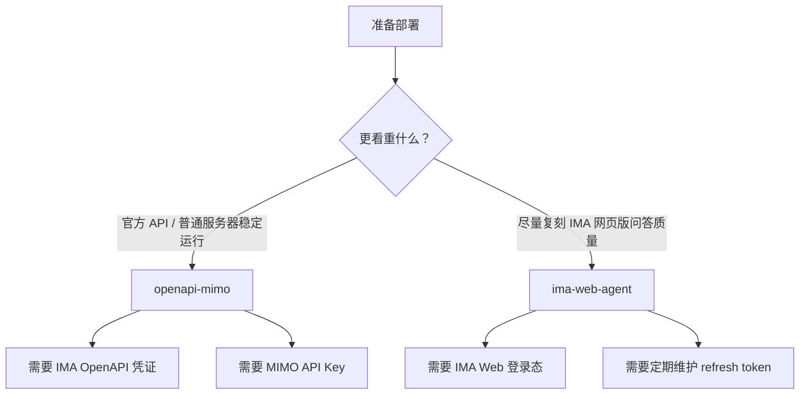

# Deployment Guide

这份文档给接手项目的人看：先说明要准备哪些凭证，再说明如何部署、如何给别的网站调用、哪里容易踩坑。

## 先理解知识库

IMA 里可能有很多知识库，但这个服务永远只读一个固定知识库。原因很简单：

- 安全：前端不能传一个新的知识库 ID 来偷查别的库。
- 稳定：所有回答都来自同一套资料，方便排查和对齐体验。
- 维护：换库时只改服务端环境变量，不改接入网站。

所以接手人只要记住：知识库 ID 是服务端配置，不是 API 请求参数。

## 两个知识库 ID

这个项目里有两个名字很像、但不能混用的 ID：

| 变量 | 对应模式 | 来源 | 常见错误 |
| --- | --- | --- | --- |
| `IMA_WEB_KNOWLEDGE_BASE_ID` | `ima-web-agent` | IMA 网页 URL 或网页请求参数 | 拿 OpenAPI 的共享库 ID 来填，导致 Web Agent 找不到正确库 |
| `IMA_SHARED_KNOWLEDGE_BASE_ID` | `openapi-mimo` | IMA OpenAPI / agent-interface 侧的共享知识库 ID | 拿网页数字 ID 来填，导致 OpenAPI `search_knowledge` 搜不到 |

如果你不确定哪个 ID 对，应先在 IMA 网页里进入目标共享知识库，确认网页版问答能通过 `@共享知识库` 命中资料；再在 OpenAPI 侧确认 `search_knowledge` 使用的是对应共享库 ID。

## 部署路径选择



推荐给外部用户或开源用户的默认路径是 `openapi-mimo`。它是常规服务器凭证模式。

如果你们内部能维护 IMA 登录态，并且最在意“像 IMA 网页版一样回答”，再用 `ima-web-agent`。

## 凭证详解

### `IMA_QA_PROVIDER`

选择问答后端。

| 值 | 含义 |
| --- | --- |
| `ima-web-agent` | 使用 IMA 网页的知识库 Agent 私有接口 |
| `openapi-mimo` | 使用 IMA OpenAPI 搜索，再用小米 MIMO 生成答案 |

### IMA Web Agent 凭证

这些变量只给 `ima-web-agent` 模式用。

| 变量 | 怎么理解 | 从哪里来 | 是否秘密 |
| --- | --- | --- | --- |
| `IMA_WEB_KNOWLEDGE_BASE_ID` | IMA 网页 URL 或内部请求里的数字知识库 ID | 已登录 IMA 网页，进入目标共享知识库后查看页面/请求参数 | 不算密钥，但不建议公开业务真实值 |
| `IMA_WEB_AGENT_HEADERS_JSON` | 服务端访问 IMA 网页私有接口所需登录态 | 从已登录 IMA Web 会话提取 | 是 |
| `IMA_WEB_AGENT_MODEL_ID` | IMA Web Agent 使用的模型 ID | 当前默认 `official_3` | 否 |
| `IMA_WEB_AGENT_MODEL_TYPE` | IMA Web Agent 模型类型 | 当前默认 `3` | 否 |
| `IMA_WEB_AGENT_TOKEN_EXPIRES_AT` | 短 token 到期时间 | 从 IMA Web 登录态信息提取 | 不单独算密钥，但和登录态一起保存 |
| `IMA_WEB_AGENT_REFRESH_TOKEN_EXPIRES_AT` | refresh token 到期时间 | 从 IMA Web 登录态信息提取 | 不单独算密钥，但和登录态一起保存 |
| `IMA_WEB_AGENT_RUNTIME_ENV_PATH` | 刷新后回写 env 的路径 | 自己指定，推荐 `/app/runtime/ima-web-agent.env` | 否 |

人话版：`IMA_WEB_AGENT_HEADERS_JSON` 就像“这个服务登录 IMA 的通行证”。它不是给浏览器看的，也不是给客户看的，只能放在服务器 `.env` 或 `runtime/` 文件里。

短 token 一般约 2 小时有效，服务会提前刷新。refresh token 一般约 30 天有效，到期后必须重新登录 IMA Web，再生成一份新的 runtime env。

交付时建议这样分工：

- 业务方提供能访问目标共享知识库的 IMA 账号。
- 维护者用这个账号登录 IMA Web，并生成 `runtime/ima-web-agent.env`。
- 服务器只保存 runtime env，不把 cookie 或 token 发给前端。
- 接手人通过 `/healthz` 看剩余有效期，不通过日志看 token 原文。

### IMA OpenAPI 凭证

这些变量只给 `openapi-mimo` 模式用。

| 变量 | 怎么理解 | 从哪里来 | 是否秘密 |
| --- | --- | --- | --- |
| `IMA_OPENAPI_CLIENTID` | IMA OpenAPI 应用 ID | IMA OpenAPI/agent-interface 后台 | 否，但也不要随便外泄 |
| `IMA_OPENAPI_APIKEY` | IMA OpenAPI 应用密钥 | IMA OpenAPI/agent-interface 后台 | 是 |
| `IMA_SHARED_KNOWLEDGE_BASE_ID` | OpenAPI 要搜索的共享知识库 ID | IMA OpenAPI 返回或后台配置 | 不算密钥，但不建议公开业务真实值 |

人话版：这组凭证让服务端可以“合法调用 IMA 开放接口搜索固定知识库”。它不依赖浏览器登录态，更适合别人自己部署。

交付时建议让对方自己在 IMA OpenAPI 后台创建应用，然后把 `CLIENTID`、`APIKEY` 和目标共享知识库 ID 填进服务器 `.env`。不要共用你的个人 OpenAPI Key。

### 小米 MIMO 凭证

这些变量只给 `openapi-mimo` 模式用。

| 变量 | 怎么理解 | 默认值/来源 | 是否秘密 |
| --- | --- | --- | --- |
| `MIMO_BASE_URL` | OpenAI-compatible API 地址 | `https://token-plan-cn.xiaomimimo.com/v1` | 否 |
| `MIMO_API_KEY` | 调用 MIMO 的密钥 | 小米 MIMO 平台 | 是 |
| `MIMO_MODEL` | 使用哪个模型回答 | `mimo-v2.5` | 否 |

人话版：IMA OpenAPI 负责“找资料”，MIMO 负责“根据资料组织答案”。当前 Web Agent 模式不需要 MIMO。

交付时建议让对方自己创建 MIMO Key。这样账单、限额、风控都归对方账号管理。

### 生产安全配置

| 变量 | 用途 | 什么时候配 |
| --- | --- | --- |
| `ALLOWED_ORIGINS` | 限制哪些网页域名可以从浏览器跨域调用 API | 服务暴露到公网时建议配 |
| `IMA_QA_API_TOKEN` | 要求调用 `/api/ask` 时带 `Authorization: Bearer ...` | 做服务器到服务器调用时建议配 |

不要把 `IMA_QA_API_TOKEN` 写进公开网页前端。浏览器端代码人人能看见，写进去等于公开。

## Docker Deploy

```bash
cd apps/ima-qa-web
cp .env.example .env
```

编辑 `.env` 后启动：

```bash
docker compose up -d --build
docker compose logs -f ima-qa-web
curl http://127.0.0.1:3117/healthz
```

如果使用 `openapi-mimo`，`.env` 至少要有：

```env
IMA_QA_PROVIDER=openapi-mimo
IMA_OPENAPI_CLIENTID=...
IMA_OPENAPI_APIKEY=...
IMA_SHARED_KNOWLEDGE_BASE_ID=...
MIMO_API_KEY=...
MIMO_BASE_URL=https://token-plan-cn.xiaomimimo.com/v1
MIMO_MODEL=mimo-v2.5
PORT=3000
HOST_PORT=3117
```

如果使用 `ima-web-agent`，`.env` 至少要有：

```env
IMA_QA_PROVIDER=ima-web-agent
IMA_WEB_KNOWLEDGE_BASE_ID=...
IMA_WEB_AGENT_HEADERS_JSON={"x-ima-cookie":"...","x-ima-bkn":"..."}
IMA_WEB_AGENT_MODEL_ID=official_3
IMA_WEB_AGENT_MODEL_TYPE=3
IMA_WEB_AGENT_RUNTIME_ENV_PATH=/app/runtime/ima-web-agent.env
PORT=3000
HOST_PORT=3117
```

端口说明：

| 变量 | 含义 |
| --- | --- |
| `PORT` | 容器内 Express 监听端口，默认 `3000` |
| `HOST_PORT` | 宿主机暴露端口，默认 `3117` |

## Plain Node Deploy

```bash
cd apps/ima-qa-web
npm ci --omit=dev
cp .env.example .env
npm start
```

生产环境建议交给 systemd、PM2、Docker 或云平台的服务管理器。macOS LaunchAgent 只适合本地开发机，不适合 Linux 服务器。

## Nginx Reverse Proxy

本项目用 SSE 流式输出，Nginx 要关 buffering：

```nginx
location / {
  proxy_pass http://127.0.0.1:3117;
  proxy_http_version 1.1;
  proxy_set_header Host $host;
  proxy_set_header X-Forwarded-For $proxy_add_x_forwarded_for;
  proxy_set_header X-Forwarded-Proto $scheme;
  proxy_buffering off;
  proxy_cache off;
  proxy_read_timeout 300s;
}
```

## How Other Sites Call It

有两种接入方式。

方式一：iframe 嵌入现成页面：

```html
<iframe
  src="https://your-domain.example.com/embed.html"
  style="width: 100%; height: 640px; border: 0"
></iframe>
```

方式二：业务网站自己做 UI，调用 API：

```bash
curl -N \
  -H 'Accept: text/event-stream' \
  -H 'Content-Type: application/json' \
  -d '{"question":"3DGS 是什么？"}' \
  https://your-domain.example.com/api/ask
```

如果配置了 `IMA_QA_API_TOKEN`：

```bash
curl -N \
  -H 'Authorization: Bearer YOUR_TOKEN' \
  -H 'Accept: text/event-stream' \
  -H 'Content-Type: application/json' \
  -d '{"question":"3DGS 是什么？"}' \
  https://your-domain.example.com/api/ask
```

## Health Check

```bash
curl https://your-domain.example.com/healthz
```

正常会看到：

```json
{
  "ok": true,
  "provider": "ima-web-agent",
  "model": "official_3",
  "auth": {
    "tokenSecondsRemaining": 3600,
    "refreshTokenSecondsRemaining": 2500000,
    "runtimePersistence": "enabled"
  }
}
```

`healthz` 是脱敏的，不会返回 cookie、API Key 或 token 原文。

## Security Checklist

- 提交到 GitHub 的只能是 `.env.example`，不能是 `.env`。
- 不能提交 `runtime/`、`node_modules/`、浏览器 profile、日志、截图里的 token。
- 对公网开放前，加 Nginx/网关限流。
- 需要服务端调用时，配置 `IMA_QA_API_TOKEN`。
- 需要浏览器跨域调用时，配置 `ALLOWED_ORIGINS`。
- Web Agent 模式要安排 refresh token 过期前的维护流程。

## Open Source Release Checklist

发布前检查：

```bash
npm test
rg -n "真实密钥片段|真实知识库ID|IMA-TOKEN=|IMA-REFRESH-TOKEN=" .
```

确认提交内容包含源码、测试、Dockerfile、compose、README、部署文档、LICENSE、package lock；不包含任何真实凭证或业务私有知识库内容。
